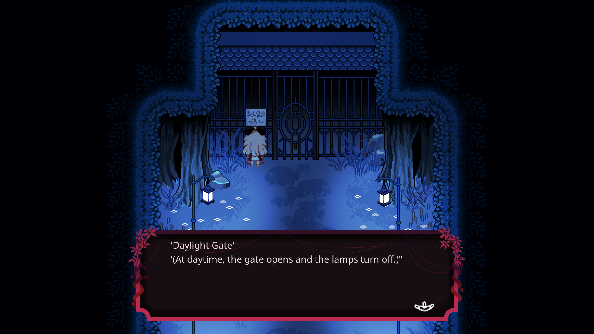
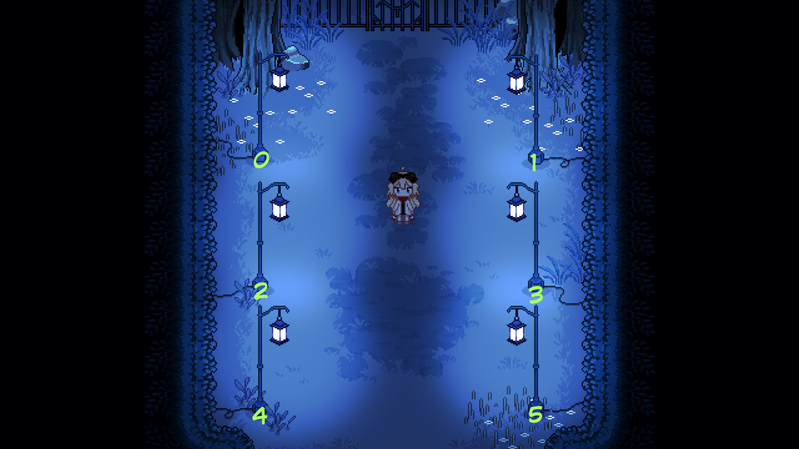

# Daylight Gate Puzzle — Q-Learning Solution

## Problem Description
This project addresses the **Daylight Gate** puzzle from *[Paper Lily – Chapter 1](https://store.steampowered.com/app/2220360/Paper_Lily__Chapter_1/)*. The gate can only be opened during the daytime, which is indicated by all surrounding lamps being turned off.  
  

There are **six lamps** positioned around the gate, each assigned a unique index from 0 to 5. The goal of the puzzle is to switch **all lamps off** in order to open the gate.  
  
## Puzzle Mechanics

The core difficulty of this puzzle comes from the **interdependent switches**. Pressing a switch not only changes the state of the selected lamp, but also toggles the states of several other lamps.

For example:
- Pressing the switch of **lamp 0** also affects **lamp 2** and **lamp 4**.
- Pressing the switch of **lamp 1** affects **lamp 0**, **lamp 4**, and **lamp 5**.
- **Lamp 2** is connected to **lamp 1**, **lamp 4**, and **lamp 5**, and similar relationships exist for the remaining lamps.

These interactions can be represented as a **switch–lamp mapping**, which defines how each switch influences the lamp states.

## Limitations of Trial and Error

A manual trial-and-error approach involves repeatedly pressing different switch combinations in the hope of reaching the desired configuration. Due to the complexity of the switch interactions, this method can be time-consuming and inefficient.

## Q-Learning Approach

To solve the puzzle efficiently, this project employs **Q-learning**, a model-free reinforcement learning algorithm.

The puzzle is modeled as:
- **State (s):** The on/off configuration of the six lamps  
- **Action (a):** Pressing one of the six switches  
- **Reward (r):**  
  - Positive reward when all lamps are turned off  
  - Small penalty for each action to encourage faster solutions  

During training, the agent interacts with the environment by pressing switches and observing the resulting lamp configurations. The learned experience is stored in a **Q-table**, which estimates the quality of taking a specific action in a given state, denoted as **Q(s, a)**.

After sufficient training, the agent is able to identify an effective sequence of switch presses to turn off all lamps and successfully open the Daylight Gate.
